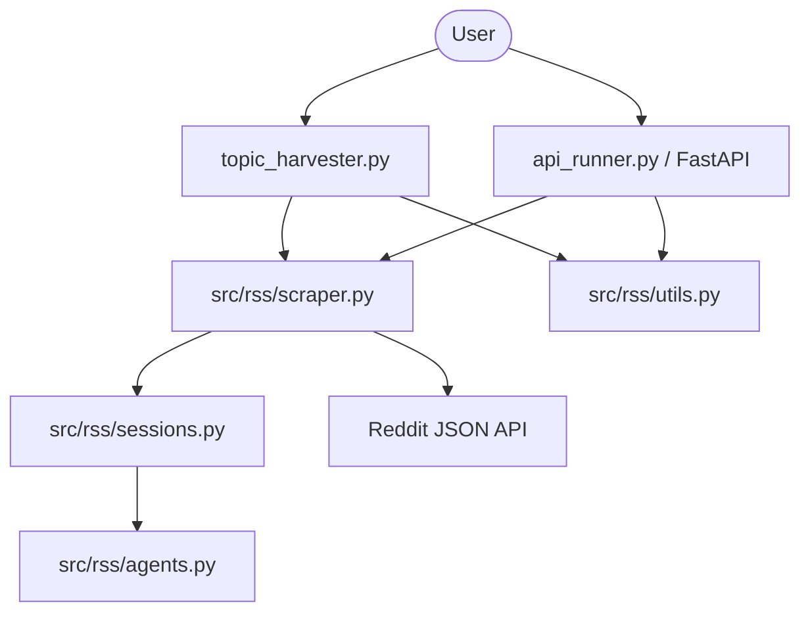

# Reddit Scraper (RSS) - Project Documentation

## 1. Overview

**Reddit Scraper (RSS)** is a robust, modularized Python application designed for harvesting data from Reddit. It provides a CLI interface, a REST API, and a core scraping engine that handles pagination, media downloads, and user-agent rotation to ensure reliable data extraction.

---

## 2. Project Structure

```bash
d:\RSS
├── topic_harvester.py       # Main CLI entry point
├── api_runner.py            # Script to run the FastAPI server
├── config.json              # Configuration for search parameters
├── src/
│   └── rss/
│       ├── scraper.py       # Core scraping logic (RSS Class)
│       ├── api.py           # FastAPI application definition
│       ├── sessions.py      # Custom requests Session for UA rotation
│       ├── agents.py        # User-Agent data and randomization
│       └── utils.py         # Utility functions (Logging, Media, Export)
└── pyproject.toml           # Project dependencies and metadata
```

---

## 3. Component Architecture

### 3.1 Flow Diagram



---

## 4. Class & Function Reference

### 4.1 `src/rss/scraper.py`

The core engine of the project.

#### Class: `RSS`

The primary client for interacting with Reddit's JSON API.

| Method                                           | Description                                                            | Called From                         |
| :----------------------------------------------- | :--------------------------------------------------------------------- | :---------------------------------- |
| `__init__(proxy, timeout, random_user_agent)`    | Initializes the session with optional proxy and UA rotation settings.  | CLI, API                            |
| `handle_search(url, params, after, before)`      | Low-level method to execute requests and parse Reddit's JSON response. | `search_reddit`, `search_subreddit` |
| `search_reddit(query, limit, sort, time_filter)` | High-level search across all of Reddit with pagination support.        | CLI, API                            |
| `search_subreddit(subreddit, query, limit, ...)` | Searches for posts within a specific subreddit.                        | API                                 |
| `scrape_post_details(permalink)`                 | Fetches a post's full content and recursively extracts comments.       | CLI, API                            |
| `_extract_comments(comments)`                    | Internal recursive function to flatten Reddit's nested comment tree.   | `scrape_post_details`               |
| `scrape_user_data(username, limit)`              | Scrapes posts and comments made by a specific Redditor.                | API                                 |
| `fetch_subreddit_posts(subreddit, ...)`          | Fetches the latest posts from a subreddit (hot, new, top, etc.).       | API                                 |

---

### 4.2 `src/rss/utils.py`

Shared utilities for the application.

| Function                           | Description                                          | Called From |
| :--------------------------------- | :--------------------------------------------------- | :---------- |
| `setup_logging(log_file, verbose)` | Configures file and console logging.                 | CLI         |
| `display_results(results, title)`  | Prints colorized JSON to the terminal for debugging. | Development |
| `download_image(image_url, ...)`   | Downloads image/thumbnail media to a local folder.   | CLI         |
| `export_to_json(data, filename)`   | Saves harvested data to a JSON file.                 | Development |
| `export_to_csv(data, filename)`    | Saves harvested data to a CSV file.                  | Development |

---

### 4.3 `src/rss/sessions.py` & `src/rss/agents.py`

Network & Security Layer.

- **`RandomUserAgentSession` (Class)**: Extends `requests.Session`. Overrides `.request()` to inject a fresh `User-Agent` from `agents.py` on every call.
- **`get_agent()` (Function)**: Returns a random string from a pool of 7,000+ modern browser User-Agents.

---

### 4.4 `src/rss/api.py`

REST Interface (FastAPI).

| Endpoint            | Method | Parameters                                | Description                                                   |
| :------------------ | :----- | :---------------------------------------- | :------------------------------------------------------------ |
| `/search`           | GET    | `q`, `limit`, `sort`, `time`, `time_slot` | Searches Reddit and applies optional 1ST time-slot filtering. |
| `/post`             | GET    | `permalink`                               | Returns full post details and comments.                       |
| `/subreddit/{name}` | GET    | `limit`, `category`, `time`               | Fetches subreddit feed.                                       |
| `/user/{name}`      | GET    | `limit`                                   | Fetches user activity.                                        |

---

## 5. Main Entry Points

### 5.1 CLI: `topic_harvester.py`

- **Main Function**: `main()`
- **Logic**:
  1. Parses CLI arguments (`topic`, `--limit`, etc.).
  2. Loads `config.json` for persistent settings.
  3. Calls `scraper.search_reddit()`.
  4. Applies `time_slot` filters in IST timezone.
  5. Iterates through results, calling `scraper.scrape_post_details()` for each.
  6. Downloads media and saves formatted JSON to `harvested_data/`.

### 5.2 API: `api_runner.py`

- **Logic**:
  1. Adds `src/` to `sys.path`.
  2. Starts a Uvicorn server hosting the FastAPI app from `src/rss/api.py`.
  3. Exposes documentation at `/docs` (Swagger UI).

---

## 6. Industry Standards & Best Practices

- **Modular Design**: Separation of concerns between scraping (engine), API (web), and CLI (interface).
- **Session Management**: Automated UA rotation and retry logic (via `HTTPAdapter`) to minimize 429/403 errors.
- **Type Hinting**: Extensive use of Python type hints for better IDE support and code reliability.
- **Error Handling**: Graceful handling of network timeouts, failed downloads, and invalid API responses.
- **Logging**: Comprehensive logging to `rss.log` for auditing and debugging.
